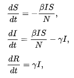
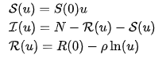
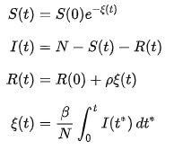
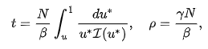
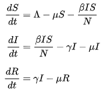
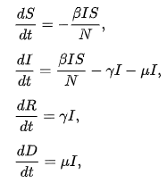

# covid19_numerical_simulation
Modeling covid-19 transmission with implicit and explicit Euler's numerical method

### Description:
Conventional susceptible, infectious, and recovery (SIR) disease model utilize ordinary differential equation to describe the dynamics of disease progression between groups. This approach is called compartmental modeling. We introduce and model the ongoing covid-19 pandemic with modified SIR differential equations. By introducing vital dynamics parameters (death rate and birth rate), we can better model the dynamic of transmission in a fixed population. 

### The base SIR model equation:

### Initial condition:

### Analytical solution for ODE:

Below are two additional approach in compartmental disease modeling using ODE and numerical methods:

### Introducing vital dynamics into the equation (Birth and death rate):

### Add death rate/fatality into the compartmental model

### Reference
1. Kermack, W. O.; McKendrick, A. G. (1927). "A Contribution to the Mathematical Theory of Epidemics". Proceedings of the Royal Society A. 115 (772): 700–721. Bibcode:1927RSPSA.115..700K. doi:10.1098/rspa.1927.0118.

2. Beckley, Ross; Weatherspoon, Cametria; Alexander, Michael; Chandler, Marissa; Johnson, Anthony; Batt, Ghan S. (2013). "Modeling epidemics with differential equations" (PDF). Tennessee State University Internal Report. Retrieved July 19, 2020.

3. Miller, J.C. (2017). "Mathematical models of SIR disease spread with combined non-sexual and sexual transmission routes". Infectious Disease Modelling. 2 (1). section 2.1.3. doi:10.1016/j.idm.2016.12.003. PMC 5963332. PMID 29928728.
